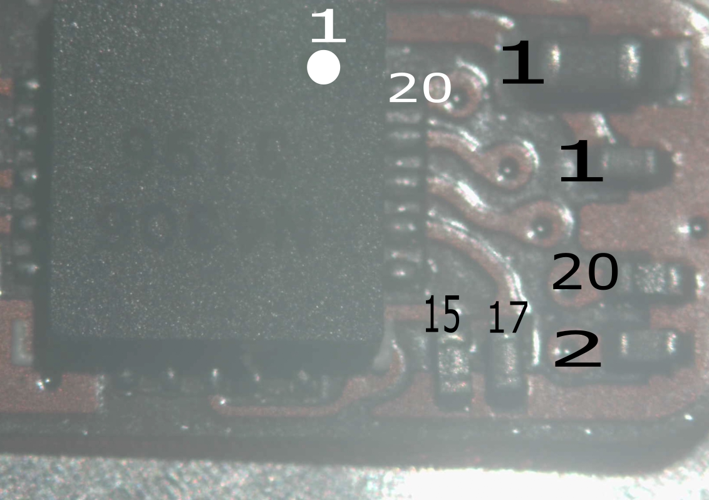

# pebble steel flex cable
This is a atempt to figure out whats on the pebble steel flex cable.  But I'm not a electrical engineer.  So some things might be a little off.

## Parts
I don't know for sure what the exact parts are.  But these seem tobe matching up very nicely.  The Ic on the top responds the exact same way as the IS31FL3199.  

* [IS31FL3199](https://www.digikey.com/en/products/detail/lumissil-microsystems/IS31FL3199-QFLS2-TR/4286437?utm_adgroup=&utm_source=google&utm_medium=cpc&utm_campaign=Pmax_Shopping_Boston%20Metro%20Category%20Awarness&utm_term=&utm_content=&utm_id=go_cmp-20837509568_adg-_ad-__dev-c_ext-_prd-4286437_sig-Cj0KCQjw5cOwBhCiARIsAJ5njuZyUMDJUlp2XiBO9IcWK7s09v9mx462ozWoL-kYqcOZMEzYlfcLx_4aAvgXEALw_wcB&gad_source=1) - LED driver
* [molex 5055511620](https://www.digikey.com/en/products/detail/molex/5055511620/10127964) 16 pin board connector.  Should be the same as in the pebble original.

## other post
* [original pebble watch](https://www.reddit.com/r/pebble/comments/10hv3ih/pebble_classic_flex_schematic/)
